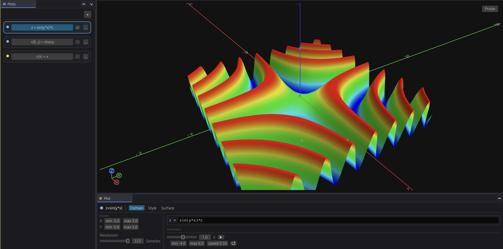

# Poincare

Poincare is an interactive 3D mathematical plotting tool built on top of [`viewport-lib`](https://github.com/grimandgreedy/viewport-lib). It is designed for exploring equations, geometry, fields, and volumetric data in a GPU-backed scientific viewport.

- Plots surfaces, curves, point clouds, vector fields, streamlines, volumes, and isosurfaces.
- Supports both built-in examples and expression-driven plot definitions.
- Uses [`viewport-lib`](https://github.com/grimandgreedy/viewport-lib) for rendering, scene submission, and GPU viewport infrastructure.
